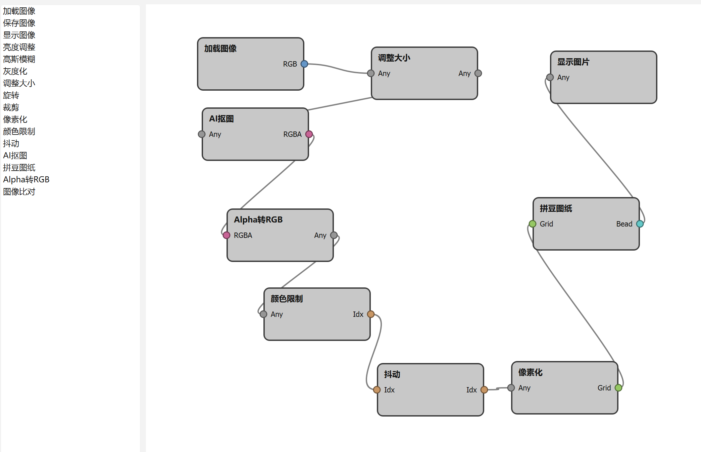

# Perler Flow - 节点式拼豆图纸生成工具

## 简介

Perler Flow 是一个基于 Qt + OpenCV 的节点式图像处理工作流工具。你可以把不同的图像处理节点拖拽到画布上、连上线、调整参数，然后一键执行整个流程。本工具特别针对**拼豆图纸生成**进行了优化，支持从普通图片自动生成带色号（如 A1、B12）的拼豆图纸。

**主要特性：**
- 16 种图像处理节点（加载、保存、亮度、模糊、灰度、裁剪、旋转、缩放、像素化、颜色限制、抖动、AI抠图、拼豆图纸、图像比对）
- 可视化节点编辑器，支持拖拽连线、移动、删除
- 右侧实时预览和参数面板
- 工作流保存/加载（JSON 格式）
- 命令行模式（无界面批量处理）
- 支持 Mard221、GameBoy、PICO8 等十余种调色板

---

## 如何操作

### 1. 启动程序

- 双击 `PerlerFlow.exe` 启动图形界面。
- 如需命令行模式（无界面批量执行已保存的工作流），打开终端执行：
```
QtWidgetsApplication.exe --workflow 工作流名字.json --no-gui
```

### 2. 界面区域说明

| 区域 | 功能 |
|------|------|
| **左侧节点列表** | 列出所有可用的图像处理节点，双击即可添加到画布中央 |
| **中间画布** | 放置节点、绘制连接线的主工作区 |
| **右侧预览区** | 显示选中节点的输出图像（通常是 ShowImage 节点的输出） |
| **右侧参数面板** | 选中节点后，这里会显示该节点的可调参数（滑条、下拉框等） |
| **底部日志区** | 显示执行状态、错误信息、颜色使用统计等 |
| **顶部工具栏** | 三个按钮：Execute Workflow（执行）、Save Workflow（保存）、Load Workflow（加载） |

### 3. 基本操作

| 操作 | 方法 |
|------|------|
| **添加节点** | 在左侧节点列表中**双击**任意节点名称，节点会出现在画布中央 |
| **移动节点** | 在节点标题栏上按住鼠标左键拖拽 |
| **连接节点** | 从节点的**右侧圆点（输出端口）**按住左键拖拽，到另一个节点的**左侧圆点（输入端口）**释放 |
| **删除节点或连线** | 选中节点或连线（单击使其高亮），按键盘上的 **Delete** 键 |
| **缩放画布** | 鼠标滚轮向上放大，向下缩小 |
| **框选多个节点** | 在画布空白处按住左键拖拽出一个矩形框 |
| **选中节点** | 单击节点（边框会变蓝） |
| **调整参数** | 选中一个节点，右侧参数面板会自动显示该节点的可调参数，修改后立即生效（下次执行工作流时会使用新值） |
| **执行工作流** | 点击顶部工具栏的 **Execute Workflow** 按钮 |
| **保存工作流** | 点击 **Save Workflow**，选择保存路径（JSON 格式） |
| **加载工作流** | 点击 **Load Workflow**，选择之前保存的 JSON 文件 |

### 4. 完整示例：生成一张拼豆图纸

以下是一个典型的拼豆工作流搭建过程：

1. **添加节点**（双击左侧列表中的节点名）：
 - 加载图像
 - 裁剪（可选）
 - AI抠图（可选，用于去背景）
 - Alpha转RGB（AI抠图输出带透明通道，需要转成普通图）
 - 像素化
 - 颜色限制（选择调色板，如 Mard221）
 - 抖动（可选，增加细节）
 - 拼豆图纸
 - 显示图片


2. **移动节点**：将各个节点拖到合适位置，避免连线交叉。

3. **连接节点**：按照上述顺序，从上一个节点的输出端口连接到下一个节点的输入端口。

4. **设置参数**：依次选中节点，在右侧调整参数，例如：
 - 加载图像节点：选择你要转换的图片文件
 - 像素化节点：设置格子大小（例如 8~12）
 - 颜色限制节点：选择调色板（例如 Mard221）
 - 拼豆图纸节点：设置单元格大小、字体大小、是否显示颜色

5. **执行**：点击 Execute Workflow。执行完成后，右侧预览区会显示最终图纸，底部日志区会输出每种颜色使用的数量（例如 `A1 : 23 个`）。

6. **保存工作流**（可选）：点击 Save Workflow 保存为 JSON 文件，下次可直接 Load 回来。

### 5. 命令行批量处理

如果你已经保存了一个工作流（例如 `workflow.json`），并且想无界面批量处理多张图片（前提是工作流中的 LoadImage 节点不写死文件路径，或者你可以手动修改 JSON 中的文件路径），可以执行。程序会在后台执行工作流，并在控制台输出日志，然后自动退出。适合集成到批处理脚本中。

---

## 注意事项

- 首次使用 **AI抠图** 节点时，需要先在 `config.h` 中填入有效的 remove.bg API Key（免费账户每月有 50 次调用额度）。
- **保存图像** 节点：需要双击节点并在弹出的文件对话框中选择保存路径，之后每次执行工作流都会覆盖该文件。
- 工作流中不能出现**循环依赖**（例如 A → B → A），否则执行时会报错。程序会在执行前自动检测环。
- 如果连接不上两个节点，请检查它们的端口类型是否兼容（例如灰度图不能直接连到颜色限制节点，中间可能需要转成彩色图）。
- 执行失败时，请查看底部日志区的红色/警告信息。

---

## 系统要求

- Windows 10 / 11（64 位）
- 已安装 Visual C++ 运行库（如果程序提示缺少 VCRUNTIME140.dll，请安装 VC++ 运行库）
- 使用 OpenCV 4.12 和 Qt 6.8.6 编译，附带动态库已打包在 `bin` 目录（如有需要）